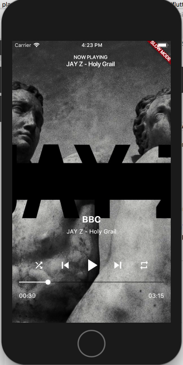

# This is an example
I currently have no plans of putting this on Pub. Originally, I did, but I lost interest. However, I think this is a good example, so I'm keeping it up.

**That being said, the license is AGPL. Please know what that means, and don't be a pirate. I will find you.**

# music_player


A music player component for Flutter (i.e. Spotify, Apple Music, etc.).

This is ready-to-go for embedding in a music-playing application.
It supports seeking, as well as having callbacks for
skipping, shuffling, and looping.

## Installation
This package is not yet on Pub (I haven't figured out how to test it),
so in the meantime:

```yaml
dependencies:
  flutter: sdk
  music_player:
    git: https://github.com/thosakwe/flutter_music_player.git
```

## Usage
```dart
class MyWidget extends StatelessWidget {
    @override
    build(BuildContext context) {
        return new MusicPlayer(
            onError: (e) {
                Scaffold.of(context).showSnackBar(
                    new SnackBar(
                        content: new Text(e),
                    ),
                );
            },
            onSkipPrevious: () {},
            onSkipNext: () {},
            onCompleted: () {},
            onLoopChanged: (loop) {
                setState(() => this.loopKind = loop);
            },
            onShuffleChanged: (loop) {
                setState(() => this.shuffle = loop);
            },
            key: musicPlayerKey,
            textColor: Colors.white,
            loop: loopKind,
            shuffle: shuffle,
            url: mp3Url,
            title: const Text(
                'BBC',
                textAlign: TextAlign.center,
                textScaleFactor: 1.5,
                style: const TextStyle(
                    fontWeight: FontWeight.bold,
                    color: Colors.white,
                ),
            ),
            subtitle: const Text(
                'JAY Z - Holy Grail',
                textAlign: TextAlign.center,
                style: const TextStyle(
                    color: Colors.white,
                ),
            ),
        );
    }
}
